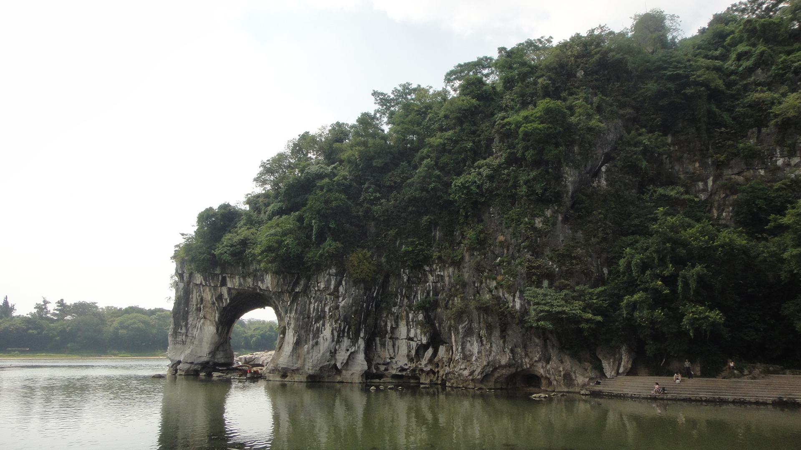

# Down to Earth - Procedural Terrain Rendering with Amazing Landscapes

The goal of this project is to adapt the existing fractional Brownian Motion Algrotihm (fBM) to generate and render real-world terrains with various landscapes. A potential final result would be to reconstruct marvelous terrains over the world (such as the following) using OpenGL.

## Unique Features

The existing (online) demos for terrain generations and rendering either rely on creating a noise texture with a third-party application in advance (then import for rendering) or applying the midpoint displacement algorithm for the heightmap generation. Some recent works in academia introduces the classic fractional Brownian Motion Algorithm (fBM) for a further randomness of the terrain landscape. Both methods are motivated by an interest in the fractal features of the terrains, i.e. they are self-similar. In nature, however, the landscapes are not completely statistically homogenous like fractals (with existing lakes, flucial and glacial erosion, etc.). In fact, the most interesting (and so-called "wonder") terrains are heterogeneous in nature. Almost no existing demos have applied the algorithm to generate and render terrains in real world. 

This project will adapt the existing fractional Brownian Motion Algrotihm (fBM) and produce a series of its variants for different shapes of terrains in *real world*. For example, we may increase the global frequency and amplitude of the noise function yet keep them small at local maxima/minima to reconstruct the terrains found in Zhangjiajie, China. We will also improve the existing texture rendering technique to make it look closer to the real world (e.g. avoid to have abrupt transition of sand and grass texturing; instead, reserve a mixing zone with some interpolation of both). Users will be able to explore these scenes with cursor and keyboard control. A good-to-have/stretch feature of the project is to generalize these methods on any mesh models for more interesting images. 

## Timeline for Implementation

- Minimum required (by this week/early next week)
  - Set up utilities (such as the view window, camera control, etc.)
  - Generate terrains using imported noise textures/heightmaps
  - Adaptive rendering of terrains with textures and phong model
  - Generate heightmaps using classic fBM algorithm
  - Produce variants of fBM algorithms to generate terrains such as Zhangjiajie, China, etc.
- Good-to-have (by next week)
  - Add lake/water textures
  - Improve the rendering with lights and shadows
- Stretch
  - Generalize the planar terrain generation to any mesh models
  - Add tree geometry with procedural generation

## Background Math and Algorithm

We introduce the baseline/main algorithm the project adapts here, namely the fractal Brownian Motion Algorithm (fBM). The specific variants of this algorithm and others will be discussed in results.

### Fractal Brownian Motion (fBM)

A Brownian Motion (BM) is a movement of an object with random increments. In other words, it is a integral of white noises so that the result paths are random yet self-similar, i.e. a zoomed-in version of the path resembles the whole path. The usual way to implementing BM in computer science is to start with some periodic base function such as *f(x) = sin(x)*. As we add several more sine functions with different amplitudes and frequencies, 

### A variant of Fractal Brownian Motion

### Terrain Generation (displacement algorithm)

