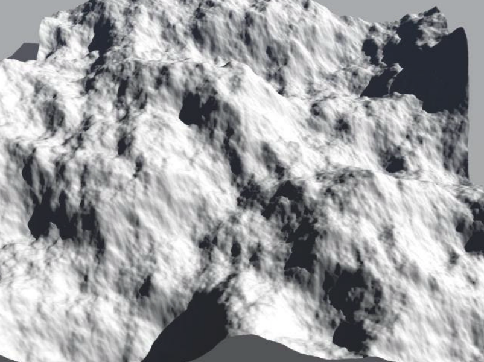
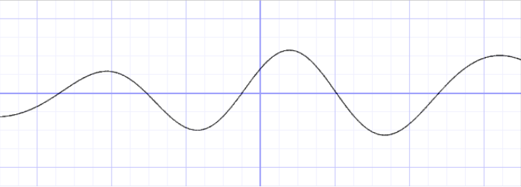
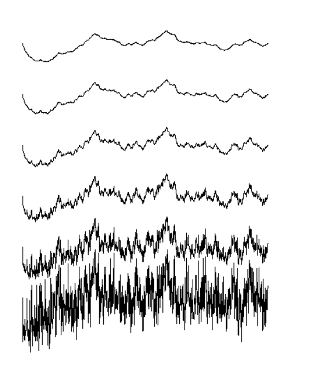
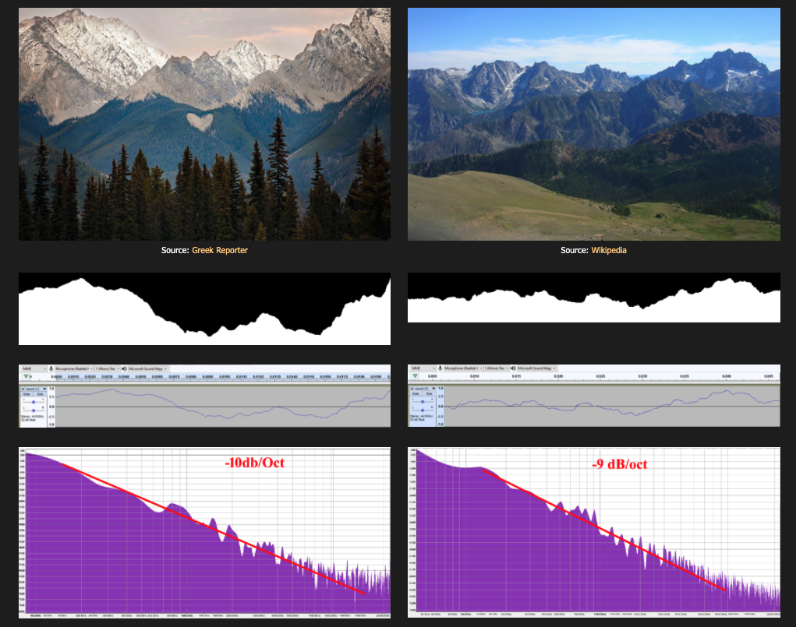
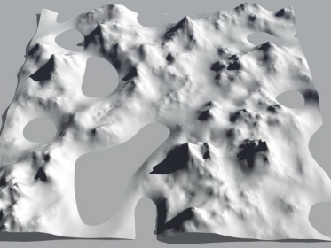
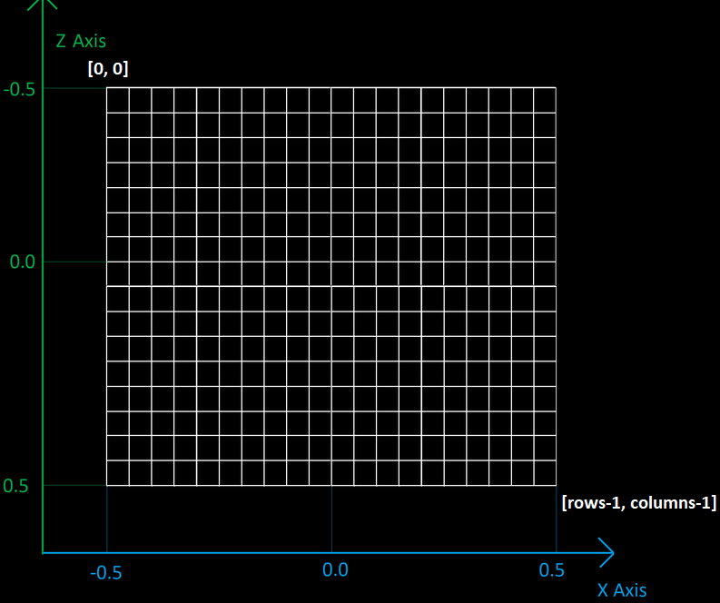
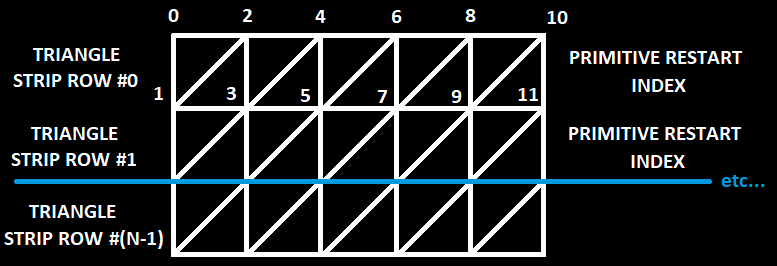

# Down to Earth - Procedural Terrain Rendering with Amazing Landscapes

The goal of this project is to adapt the existing fractional Brownian Motion Algrotihm (fBM) to generate and render real-world terrains with various landscapes. A potential final result would be to reconstruct marvelous terrains over the world (such as the following) using OpenGL.

## Unique Features

The existing (online) demos for terrain generations and rendering either rely on creating a noise texture with a third-party application in advance (then import for rendering) or applying the midpoint displacement algorithm for the heightmap generation. Some recent works in academia introduces the classic fractional Brownian Motion Algorithm (fBM) for a further randomness of the terrain landscape. Both methods are motivated by an interest in the fractal features of the terrains, i.e. they are self-similar. 

In nature, however, the landscapes are not completely statistically homogenous like fractals (with existing lakes, flucial and glacial erosion, etc.). In fact, the most interesting (and so-called "wonder") terrains are heterogeneous in nature (see the two pictures above). Almost no existing demos have applied the algorithm to generate and render terrains in real world. 

This project will adapt the existing fractional Brownian Motion Algrotihm (fBM) and produce a series of its variants for different shapes of terrains in *real world*. For example, we may increase the global frequency and amplitude of the noise function yet keep them small at local maxima/minima to reconstruct the terrains found in Zhangjiajie, China. We will also improve the existing texture rendering technique to make it look closer to the real world (e.g. avoid to have abrupt transition of sand and grass texturing; instead, reserve a mixing zone with some interpolation of both). Users will be able to explore these scenes with cursor and keyboard control. A good-to-have/stretch feature of the project is to generalize these methods on any mesh models for more interesting images. 

## Timeline for Implementation

- Minimum required (by this week/early next week)
  - Set up utilities (such as the view window, camera control, etc.)
  - Generate terrains using imported noise textures/heightmaps
  - Adaptive rendering of terrains with textures and phong model
  - Generate heightmaps using classic fBM algorithm
  - Produce variants of fBM algorithms to generate terrains such as Zhangjiajie, China, etc.
- Good-to-have (by next week)
  - Add lake/water textures
  - Improve the rendering with lights and shadows
- Stretch
  - Generalize the planar terrain generation to any mesh models
  - Add tree geometry with procedural generation

## Background Math and Algorithm

We introduce the baseline/main algorithm the project adapts here, namely the fractal Brownian Motion Algorithm (fBM). The specific variants of this algorithm and others will be discussed in results.

### Fractal Brownian Motion (fBM)

A Brownian Motion (BM) is a movement of an object with random increments. In other words, it is a integral of white noises so that the result paths are random yet self-similar, i.e. a zoomed-in version of the path resembles the whole path. The usual way to implementing BM in computer science is to start with some periodic base function such as *f(x) = sin(x)*. As we add several more sine functions with different amplitudes and frequencies (so-called *noises*), it results in a random path that becomes a fractal if we allowed the loop to continue forever.

A fractional Brownian Motion is a Brownian Motion such that we keep a memory to keep track of the proess. In each iteration, the noise we add is based on the previous ones in terms of its frequency and amplitude. In other words, the increments are not completely independent from each other so that the result landscape is inherited with additional features. To control this process, we also keep a parameter *H* called the Hurst Exponent, ranging from 0 to 1. The pseudo-code for this increment process is shown below.

When H = 1/2, the motion is reduced to BM so that every increment is independent from each other. When H = 1, the memory is positively correlated so that changes in a given direction will tend to produce future changes in the same direction and the path will then be smoother than a vanilla BM. Oppositely, the landscape becomes more curvy than BM and results in a complex landscape.

To generate a heightmap (i.e. a 2d image/matrix where each float pixel/entry represents the height of the point in the image) for a terrain, we start with a 2d periodic base function (typically Perlin noise) and increment noises as above. It turns out by (physical) experiments that the best parameter value for most mountain landscape is H = 1.

### A variant of Fractal Brownian Motion

To adapt to a terrain that is mixed with mountains and lakes, we may make the valley floors smooth by asserting that at the local minima of the base function, the noises we add to them should be damped to a low frequencies to make those places smooth. This method is proposed in https://www.classes.cs.uchicago.edu/archive/2015/fall/23700-1/final-project/MusgraveTerrain00.pdf and the result with Perlin noise looks like:

Similar adaptation can be made to deal with other specific landscapes in real world (one of which is mentioned above).

### Planar Terrain Generation

After the heightmap generation, it follows a routine procedure to generate a planar terrain by displacement. In particular, we start with a plane of grid (whose size depends on the resolution) in the 3d space, where each vertex has height 0 in the beginning. Then, we load the heightmap onto the grid by locate each vertex in the map and assign the height accordingly. 

Then, we triangulate the grid (i.e. generate a mesh representation of the plane) by tiling with triangle stripes. The normal at a vertex is taken to be the sum of the normals of each triangle attached to the vertex. Finally, it suffices to feed the data into the shader (e.g. mesh viewer) for visualization.

